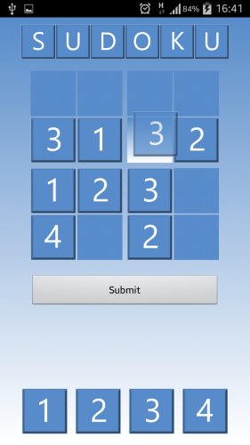

## Simple Sudoku ##

A simple 4x4 sudoku game for Android phones.

### Development ###

The game was originally developed for Android API level 18 (Android 4.3 Jelly Bean).

### Gameplay ###

The game includes two levels of gameplay:

`Level 1` provides a partially filled grid and `Level 2` provides an empty grid.

Players will have to drag and drop numbered tiles into the respective boxes to win. The standard rules of sudoku apply.

 
